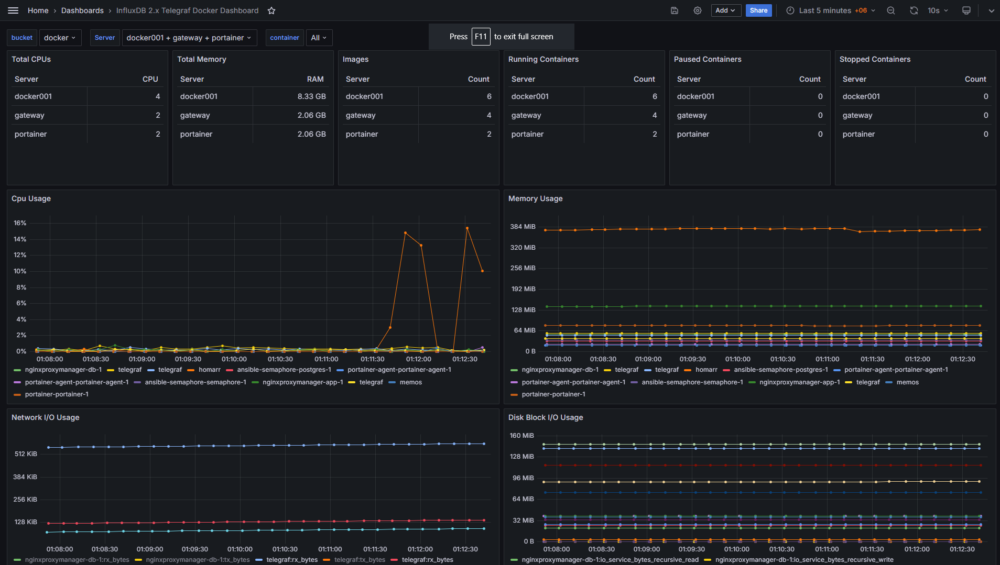

### Grafana dashboard for Docker containers on multiple hosts

Forked from https://grafana.com/grafana/dashboards/17020-docker-dashboard/ in order to implement server/host filter

#### Changes made:
- All queries modified to support filter by `engine_host` (machine running Docker itself)
- Informational panels switch to table view

#### Installation prerequisites:
- InfluxDB 2.x
- Telegraf collector

#### Installation steps alternatives:
1. Download [dashboard.json](dashboard.json) and import as usual

or

2. Copy-paste [raw dashboard.json](https://raw.githubusercontent.com/akuznecov/grafana-influxdb2-docker-dashboard/main/dashboard.json) content and import as usual

